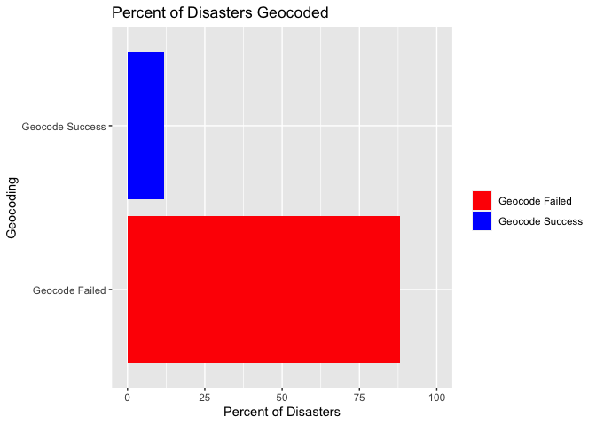

Abstract
--------

EM-DAT is a very popular disaster dataset among researchers in the field
of Earth and Environmental science. However, it comes with challenges,
in its format and otherwise, that make it unsuitable to a tidy data
science workflow in popular environments like R. The Wrangler for
Emergency Events Database, weed for short, aims to provide researchers
with the right tools to easily prepare EM-DAT data for downstream
analysis, as well as some exploration of the same. The sample workflow
here demonstrates the capabilities of weed through its functions.

Keywords
--------

Introduction
------------

WEED (Wrangler for Emergency Events Database) is an R Package designed
to help researches in the field of climatological disaster studies
better analyse EM-DAT and other related datasets. As will be explained
in later sections of this paper, EM-DAT contains a lot of useful
climatoligical and sociological data pertaining to natural disasters.
However, it has a few drawbacks in its presentation of geolocation data
as well as its unsuitability to a tidy data science workflow.

WEED attempts to solve and eradicate these issues to help researchers
glean valuable insights from their EM-DAT dataset!

Structure of The Package
------------------------

The structure of the Wrangler for Emergency Events Database is best
explained through a sample workflow.

### Loading

First, one may download the subset of EM-DAT required from the public
EM-DAT query tool located at [this link](https://public.emdat.be/). From
here, researchers can exploit the loading functionality of WEED. EM-DAT
files tend to be excel sheets with a few lines of metadata, followed by
the subsection of the dataset downloaded. The read\_emdat function
allows researchers to load the dataset as a List in one of two ways: the
dataset, as well as its metadata, or just the dataset.

    sample_data <- read_emdat(here("data", "emdat_public_2021_01_12_full.xlsx"))

    ## New names:
    ## * `` -> ...1
    ## * `` -> ...2

    summary(sample_data)

<!--html_preserve-->

<table class="gt_table">
<thead class="gt_header">
<tr>
<th colspan="43" class="gt_heading gt_title gt_font_normal" style>
Sample Data
</th>
</tr>
<tr>
<th colspan="43" class="gt_heading gt_subtitle gt_font_normal gt_bottom_border" style>
</th>
</tr>
</thead>
<thead class="gt_col_headings">
<tr>
<th class="gt_col_heading gt_columns_bottom_border gt_left" rowspan="1" colspan="1">
Dis No
</th>
<th class="gt_col_heading gt_columns_bottom_border gt_left" rowspan="1" colspan="1">
Year
</th>
<th class="gt_col_heading gt_columns_bottom_border gt_left" rowspan="1" colspan="1">
Seq
</th>
<th class="gt_col_heading gt_columns_bottom_border gt_left" rowspan="1" colspan="1">
Disaster Group
</th>
<th class="gt_col_heading gt_columns_bottom_border gt_left" rowspan="1" colspan="1">
Disaster Subgroup
</th>
<th class="gt_col_heading gt_columns_bottom_border gt_left" rowspan="1" colspan="1">
Disaster Type
</th>
<th class="gt_col_heading gt_columns_bottom_border gt_left" rowspan="1" colspan="1">
Disaster Subtype
</th>
<th class="gt_col_heading gt_columns_bottom_border gt_left" rowspan="1" colspan="1">
Disaster Subsubtype
</th>
<th class="gt_col_heading gt_columns_bottom_border gt_left" rowspan="1" colspan="1">
Event Name
</th>
<th class="gt_col_heading gt_columns_bottom_border gt_left" rowspan="1" colspan="1">
Entry Criteria
</th>
<th class="gt_col_heading gt_columns_bottom_border gt_left" rowspan="1" colspan="1">
Country
</th>
<th class="gt_col_heading gt_columns_bottom_border gt_left" rowspan="1" colspan="1">
ISO
</th>
<th class="gt_col_heading gt_columns_bottom_border gt_left" rowspan="1" colspan="1">
Region
</th>
<th class="gt_col_heading gt_columns_bottom_border gt_left" rowspan="1" colspan="1">
Continent
</th>
<th class="gt_col_heading gt_columns_bottom_border gt_left" rowspan="1" colspan="1">
Location
</th>
<th class="gt_col_heading gt_columns_bottom_border gt_left" rowspan="1" colspan="1">
Origin
</th>
<th class="gt_col_heading gt_columns_bottom_border gt_left" rowspan="1" colspan="1">
Associated Dis
</th>
<th class="gt_col_heading gt_columns_bottom_border gt_left" rowspan="1" colspan="1">
Associated Dis2
</th>
<th class="gt_col_heading gt_columns_bottom_border gt_left" rowspan="1" colspan="1">
OFDA Response
</th>
<th class="gt_col_heading gt_columns_bottom_border gt_left" rowspan="1" colspan="1">
Appeal
</th>
<th class="gt_col_heading gt_columns_bottom_border gt_left" rowspan="1" colspan="1">
Declaration
</th>
<th class="gt_col_heading gt_columns_bottom_border gt_center" rowspan="1" colspan="1">
Aid Contribution
</th>
<th class="gt_col_heading gt_columns_bottom_border gt_right" rowspan="1" colspan="1">
Dis Mag Value
</th>
<th class="gt_col_heading gt_columns_bottom_border gt_left" rowspan="1" colspan="1">
Dis Mag Scale
</th>
<th class="gt_col_heading gt_columns_bottom_border gt_left" rowspan="1" colspan="1">
Latitude
</th>
<th class="gt_col_heading gt_columns_bottom_border gt_left" rowspan="1" colspan="1">
Longitude
</th>
<th class="gt_col_heading gt_columns_bottom_border gt_left" rowspan="1" colspan="1">
Local Time
</th>
<th class="gt_col_heading gt_columns_bottom_border gt_left" rowspan="1" colspan="1">
River Basin
</th>
<th class="gt_col_heading gt_columns_bottom_border gt_right" rowspan="1" colspan="1">
Start Year
</th>
<th class="gt_col_heading gt_columns_bottom_border gt_right" rowspan="1" colspan="1">
Start Month
</th>
<th class="gt_col_heading gt_columns_bottom_border gt_right" rowspan="1" colspan="1">
Start Day
</th>
<th class="gt_col_heading gt_columns_bottom_border gt_right" rowspan="1" colspan="1">
End Year
</th>
<th class="gt_col_heading gt_columns_bottom_border gt_right" rowspan="1" colspan="1">
End Month
</th>
<th class="gt_col_heading gt_columns_bottom_border gt_right" rowspan="1" colspan="1">
End Day
</th>
<th class="gt_col_heading gt_columns_bottom_border gt_right" rowspan="1" colspan="1">
Total Deaths
</th>
<th class="gt_col_heading gt_columns_bottom_border gt_right" rowspan="1" colspan="1">
No Injured
</th>
<th class="gt_col_heading gt_columns_bottom_border gt_right" rowspan="1" colspan="1">
No Affected
</th>
<th class="gt_col_heading gt_columns_bottom_border gt_right" rowspan="1" colspan="1">
No Homeless
</th>
<th class="gt_col_heading gt_columns_bottom_border gt_right" rowspan="1" colspan="1">
Total Affected
</th>
<th class="gt_col_heading gt_columns_bottom_border gt_center" rowspan="1" colspan="1">
Reconstruction Costs (’000
US$)&lt;/th&gt;  &lt;th class="gt\_col\_heading gt\_columns\_bottom\_border gt\_center" rowspan="1" colspan="1"&gt;Insured Damages ('000 US$)
</th>
<th class="gt_col_heading gt_columns_bottom_border gt_right" rowspan="1" colspan="1">
Total Damages (’000 US$)
</th>
<th class="gt_col_heading gt_columns_bottom_border gt_right" rowspan="1" colspan="1">
CPI
</th>
</tr>
</thead>
<tbody class="gt_table_body">
<tr>
<td class="gt_row gt_left">
1900-9002-CPV
</td>
<td class="gt_row gt_left">
1900
</td>
<td class="gt_row gt_left">
9002
</td>
<td class="gt_row gt_left">
Natural
</td>
<td class="gt_row gt_left">
Climatological
</td>
<td class="gt_row gt_left">
Drought
</td>
<td class="gt_row gt_left">
Drought
</td>
<td class="gt_row gt_left">
NA
</td>
<td class="gt_row gt_left">
NA
</td>
<td class="gt_row gt_left">
NA
</td>
<td class="gt_row gt_left">
Cabo Verde
</td>
<td class="gt_row gt_left">
CPV
</td>
<td class="gt_row gt_left">
Western Africa
</td>
<td class="gt_row gt_left">
Africa
</td>
<td class="gt_row gt_left">
Countrywide
</td>
<td class="gt_row gt_left">
NA
</td>
<td class="gt_row gt_left">
Famine
</td>
<td class="gt_row gt_left">
NA
</td>
<td class="gt_row gt_left">
NA
</td>
<td class="gt_row gt_left">
No
</td>
<td class="gt_row gt_left">
No
</td>
<td class="gt_row gt_center">
NA
</td>
<td class="gt_row gt_right">
NA
</td>
<td class="gt_row gt_left">
Km2
</td>
<td class="gt_row gt_left">
NA
</td>
<td class="gt_row gt_left">
NA
</td>
<td class="gt_row gt_left">
NA
</td>
<td class="gt_row gt_left">
NA
</td>
<td class="gt_row gt_right">
1900
</td>
<td class="gt_row gt_right">
NA
</td>
<td class="gt_row gt_right">
NA
</td>
<td class="gt_row gt_right">
1900
</td>
<td class="gt_row gt_right">
NA
</td>
<td class="gt_row gt_right">
NA
</td>
<td class="gt_row gt_right">
11000
</td>
<td class="gt_row gt_right">
NA
</td>
<td class="gt_row gt_right">
NA
</td>
<td class="gt_row gt_right">
NA
</td>
<td class="gt_row gt_right">
NA
</td>
<td class="gt_row gt_center">
NA
</td>
<td class="gt_row gt_center">
NA
</td>
<td class="gt_row gt_right">
NA
</td>
<td class="gt_row gt_right">
3.261389
</td>
</tr>
<tr>
<td class="gt_row gt_left">
1900-9001-IND
</td>
<td class="gt_row gt_left">
1900
</td>
<td class="gt_row gt_left">
9001
</td>
<td class="gt_row gt_left">
Natural
</td>
<td class="gt_row gt_left">
Climatological
</td>
<td class="gt_row gt_left">
Drought
</td>
<td class="gt_row gt_left">
Drought
</td>
<td class="gt_row gt_left">
NA
</td>
<td class="gt_row gt_left">
NA
</td>
<td class="gt_row gt_left">
NA
</td>
<td class="gt_row gt_left">
India
</td>
<td class="gt_row gt_left">
IND
</td>
<td class="gt_row gt_left">
Southern Asia
</td>
<td class="gt_row gt_left">
Asia
</td>
<td class="gt_row gt_left">
Bengal
</td>
<td class="gt_row gt_left">
NA
</td>
<td class="gt_row gt_left">
NA
</td>
<td class="gt_row gt_left">
NA
</td>
<td class="gt_row gt_left">
NA
</td>
<td class="gt_row gt_left">
No
</td>
<td class="gt_row gt_left">
No
</td>
<td class="gt_row gt_center">
NA
</td>
<td class="gt_row gt_right">
NA
</td>
<td class="gt_row gt_left">
Km2
</td>
<td class="gt_row gt_left">
NA
</td>
<td class="gt_row gt_left">
NA
</td>
<td class="gt_row gt_left">
NA
</td>
<td class="gt_row gt_left">
NA
</td>
<td class="gt_row gt_right">
1900
</td>
<td class="gt_row gt_right">
NA
</td>
<td class="gt_row gt_right">
NA
</td>
<td class="gt_row gt_right">
1900
</td>
<td class="gt_row gt_right">
NA
</td>
<td class="gt_row gt_right">
NA
</td>
<td class="gt_row gt_right">
1250000
</td>
<td class="gt_row gt_right">
NA
</td>
<td class="gt_row gt_right">
NA
</td>
<td class="gt_row gt_right">
NA
</td>
<td class="gt_row gt_right">
NA
</td>
<td class="gt_row gt_center">
NA
</td>
<td class="gt_row gt_center">
NA
</td>
<td class="gt_row gt_right">
NA
</td>
<td class="gt_row gt_right">
3.261389
</td>
</tr>
<tr>
<td class="gt_row gt_left">
1901-0003-BEL
</td>
<td class="gt_row gt_left">
1901
</td>
<td class="gt_row gt_left">
0003
</td>
<td class="gt_row gt_left">
Technological
</td>
<td class="gt_row gt_left">
Technological
</td>
<td class="gt_row gt_left">
Industrial accident
</td>
<td class="gt_row gt_left">
Explosion
</td>
<td class="gt_row gt_left">
NA
</td>
<td class="gt_row gt_left">
Coal mine
</td>
<td class="gt_row gt_left">
Kill
</td>
<td class="gt_row gt_left">
Belgium
</td>
<td class="gt_row gt_left">
BEL
</td>
<td class="gt_row gt_left">
Western Europe
</td>
<td class="gt_row gt_left">
Europe
</td>
<td class="gt_row gt_left">
Hornu
</td>
<td class="gt_row gt_left">
NA
</td>
<td class="gt_row gt_left">
NA
</td>
<td class="gt_row gt_left">
NA
</td>
<td class="gt_row gt_left">
NA
</td>
<td class="gt_row gt_left">
No
</td>
<td class="gt_row gt_left">
No
</td>
<td class="gt_row gt_center">
NA
</td>
<td class="gt_row gt_right">
NA
</td>
<td class="gt_row gt_left">
m3
</td>
<td class="gt_row gt_left">
NA
</td>
<td class="gt_row gt_left">
NA
</td>
<td class="gt_row gt_left">
NA
</td>
<td class="gt_row gt_left">
NA
</td>
<td class="gt_row gt_right">
1901
</td>
<td class="gt_row gt_right">
4
</td>
<td class="gt_row gt_right">
27
</td>
<td class="gt_row gt_right">
1901
</td>
<td class="gt_row gt_right">
4
</td>
<td class="gt_row gt_right">
27
</td>
<td class="gt_row gt_right">
18
</td>
<td class="gt_row gt_right">
NA
</td>
<td class="gt_row gt_right">
NA
</td>
<td class="gt_row gt_right">
NA
</td>
<td class="gt_row gt_right">
NA
</td>
<td class="gt_row gt_center">
NA
</td>
<td class="gt_row gt_center">
NA
</td>
<td class="gt_row gt_right">
NA
</td>
<td class="gt_row gt_right">
3.261389
</td>
</tr>
<tr>
<td class="gt_row gt_left">
1902-0012-GTM
</td>
<td class="gt_row gt_left">
1902
</td>
<td class="gt_row gt_left">
0012
</td>
<td class="gt_row gt_left">
Natural
</td>
<td class="gt_row gt_left">
Geophysical
</td>
<td class="gt_row gt_left">
Earthquake
</td>
<td class="gt_row gt_left">
Ground movement
</td>
<td class="gt_row gt_left">
NA
</td>
<td class="gt_row gt_left">
NA
</td>
<td class="gt_row gt_left">
Kill
</td>
<td class="gt_row gt_left">
Guatemala
</td>
<td class="gt_row gt_left">
GTM
</td>
<td class="gt_row gt_left">
Central America
</td>
<td class="gt_row gt_left">
Americas
</td>
<td class="gt_row gt_left">
Quezaltenango, San Marcos
</td>
<td class="gt_row gt_left">
NA
</td>
<td class="gt_row gt_left">
Tsunami/Tidal wave
</td>
<td class="gt_row gt_left">
NA
</td>
<td class="gt_row gt_left">
NA
</td>
<td class="gt_row gt_left">
NA
</td>
<td class="gt_row gt_left">
NA
</td>
<td class="gt_row gt_center">
NA
</td>
<td class="gt_row gt_right">
8
</td>
<td class="gt_row gt_left">
Richter
</td>
<td class="gt_row gt_left">
14
</td>
<td class="gt_row gt_left">
-91
</td>
<td class="gt_row gt_left">
20:20
</td>
<td class="gt_row gt_left">
NA
</td>
<td class="gt_row gt_right">
1902
</td>
<td class="gt_row gt_right">
4
</td>
<td class="gt_row gt_right">
18
</td>
<td class="gt_row gt_right">
1902
</td>
<td class="gt_row gt_right">
4
</td>
<td class="gt_row gt_right">
18
</td>
<td class="gt_row gt_right">
2000
</td>
<td class="gt_row gt_right">
NA
</td>
<td class="gt_row gt_right">
NA
</td>
<td class="gt_row gt_right">
NA
</td>
<td class="gt_row gt_right">
NA
</td>
<td class="gt_row gt_center">
NA
</td>
<td class="gt_row gt_center">
NA
</td>
<td class="gt_row gt_right">
25000
</td>
<td class="gt_row gt_right">
3.391845
</td>
</tr>
<tr>
<td class="gt_row gt_left">
1902-0003-GTM
</td>
<td class="gt_row gt_left">
1902
</td>
<td class="gt_row gt_left">
0003
</td>
<td class="gt_row gt_left">
Natural
</td>
<td class="gt_row gt_left">
Geophysical
</td>
<td class="gt_row gt_left">
Volcanic activity
</td>
<td class="gt_row gt_left">
Ash fall
</td>
<td class="gt_row gt_left">
NA
</td>
<td class="gt_row gt_left">
Santa Maria
</td>
<td class="gt_row gt_left">
Kill
</td>
<td class="gt_row gt_left">
Guatemala
</td>
<td class="gt_row gt_left">
GTM
</td>
<td class="gt_row gt_left">
Central America
</td>
<td class="gt_row gt_left">
Americas
</td>
<td class="gt_row gt_left">
NA
</td>
<td class="gt_row gt_left">
NA
</td>
<td class="gt_row gt_left">
NA
</td>
<td class="gt_row gt_left">
NA
</td>
<td class="gt_row gt_left">
NA
</td>
<td class="gt_row gt_left">
NA
</td>
<td class="gt_row gt_left">
NA
</td>
<td class="gt_row gt_center">
NA
</td>
<td class="gt_row gt_right">
NA
</td>
<td class="gt_row gt_left">
NA
</td>
<td class="gt_row gt_left">
NA
</td>
<td class="gt_row gt_left">
NA
</td>
<td class="gt_row gt_left">
NA
</td>
<td class="gt_row gt_left">
NA
</td>
<td class="gt_row gt_right">
1902
</td>
<td class="gt_row gt_right">
4
</td>
<td class="gt_row gt_right">
8
</td>
<td class="gt_row gt_right">
1902
</td>
<td class="gt_row gt_right">
4
</td>
<td class="gt_row gt_right">
8
</td>
<td class="gt_row gt_right">
1000
</td>
<td class="gt_row gt_right">
NA
</td>
<td class="gt_row gt_right">
NA
</td>
<td class="gt_row gt_right">
NA
</td>
<td class="gt_row gt_right">
NA
</td>
<td class="gt_row gt_center">
NA
</td>
<td class="gt_row gt_center">
NA
</td>
<td class="gt_row gt_right">
NA
</td>
<td class="gt_row gt_right">
3.391845
</td>
</tr>
<tr>
<td class="gt_row gt_left">
1902-0010-GTM
</td>
<td class="gt_row gt_left">
1902
</td>
<td class="gt_row gt_left">
0010
</td>
<td class="gt_row gt_left">
Natural
</td>
<td class="gt_row gt_left">
Geophysical
</td>
<td class="gt_row gt_left">
Volcanic activity
</td>
<td class="gt_row gt_left">
Ash fall
</td>
<td class="gt_row gt_left">
NA
</td>
<td class="gt_row gt_left">
Santa Maria
</td>
<td class="gt_row gt_left">
Kill
</td>
<td class="gt_row gt_left">
Guatemala
</td>
<td class="gt_row gt_left">
GTM
</td>
<td class="gt_row gt_left">
Central America
</td>
<td class="gt_row gt_left">
Americas
</td>
<td class="gt_row gt_left">
NA
</td>
<td class="gt_row gt_left">
NA
</td>
<td class="gt_row gt_left">
NA
</td>
<td class="gt_row gt_left">
NA
</td>
<td class="gt_row gt_left">
NA
</td>
<td class="gt_row gt_left">
NA
</td>
<td class="gt_row gt_left">
NA
</td>
<td class="gt_row gt_center">
NA
</td>
<td class="gt_row gt_right">
NA
</td>
<td class="gt_row gt_left">
NA
</td>
<td class="gt_row gt_left">
NA
</td>
<td class="gt_row gt_left">
NA
</td>
<td class="gt_row gt_left">
NA
</td>
<td class="gt_row gt_left">
NA
</td>
<td class="gt_row gt_right">
1902
</td>
<td class="gt_row gt_right">
10
</td>
<td class="gt_row gt_right">
24
</td>
<td class="gt_row gt_right">
1902
</td>
<td class="gt_row gt_right">
10
</td>
<td class="gt_row gt_right">
24
</td>
<td class="gt_row gt_right">
6000
</td>
<td class="gt_row gt_right">
NA
</td>
<td class="gt_row gt_right">
NA
</td>
<td class="gt_row gt_right">
NA
</td>
<td class="gt_row gt_right">
NA
</td>
<td class="gt_row gt_center">
NA
</td>
<td class="gt_row gt_center">
NA
</td>
<td class="gt_row gt_right">
NA
</td>
<td class="gt_row gt_right">
3.391845
</td>
</tr>
</tbody>
</table>

<!--/html_preserve-->
### Exploration

The next step might be to explore the given data. One of the most
pressing issues with EM-DAT at the moment is its geocoding data. The
fact that a very small fraction of disasters have usable geocoding data,
in terms of Latitude and Longitude, severely hampers location analysis.
Another issue is the presence of multiple locations per disaster.

    ## 
    ## ── Column specification ────────────────────────────────────────────────────────
    ## cols(
    ##   `Dis No` = col_character(),
    ##   Year = col_double(),
    ##   Country = col_character(),
    ##   `Disaster Type` = col_character(),
    ##   Location = col_character(),
    ##   Latitude = col_character(),
    ##   Longitude = col_character()
    ## )

    ## Warning: The `.dots` argument of `group_by()` is deprecated as of dplyr 1.0.0.
    ## This warning is displayed once every 8 hours.
    ## Call `lifecycle::last_warnings()` to see where this warning was generated.

<!--html_preserve-->

<table class="gt_table">
<thead class="gt_header">
<tr>
<th colspan="7" class="gt_heading gt_title gt_font_normal" style>
Sample Data
</th>
</tr>
<tr>
<th colspan="7" class="gt_heading gt_subtitle gt_font_normal gt_bottom_border" style>
The problems
</th>
</tr>
</thead>
<thead class="gt_col_headings">
<tr>
<th class="gt_col_heading gt_columns_bottom_border gt_left" rowspan="1" colspan="1">
Dis No
</th>
<th class="gt_col_heading gt_columns_bottom_border gt_right" rowspan="1" colspan="1">
Year
</th>
<th class="gt_col_heading gt_columns_bottom_border gt_left" rowspan="1" colspan="1">
Country
</th>
<th class="gt_col_heading gt_columns_bottom_border gt_left" rowspan="1" colspan="1">
Disaster Type
</th>
<th class="gt_col_heading gt_columns_bottom_border gt_left" rowspan="1" colspan="1">
Location
</th>
<th class="gt_col_heading gt_columns_bottom_border gt_left" rowspan="1" colspan="1">
Latitude
</th>
<th class="gt_col_heading gt_columns_bottom_border gt_left" rowspan="1" colspan="1">
Longitude
</th>
</tr>
</thead>
<tbody class="gt_table_body">
<tr>
<td class="gt_row gt_left">
2000-0919-USA
</td>
<td class="gt_row gt_right">
2000
</td>
<td class="gt_row gt_left">
United States of America (the)
</td>
<td class="gt_row gt_left">
Storm
</td>
<td class="gt_row gt_left" style="background-color: #FF7F50; color: #000000;">
Alabama, Georgia, Louisiana, North Carolina, South Carolina, Tennessee,
Virginia, New York, Pennsylvania, Massachussetts provinces
</td>
<td class="gt_row gt_left" style="background-color: #808080; color: #000000;">
NA
</td>
<td class="gt_row gt_left" style="background-color: #808080; color: #000000;">
NA
</td>
</tr>
<tr>
<td class="gt_row gt_left">
1964-0092-USA
</td>
<td class="gt_row gt_right">
1964
</td>
<td class="gt_row gt_left">
United States of America (the)
</td>
<td class="gt_row gt_left">
Flood
</td>
<td class="gt_row gt_left" style="background-color: #808080; color: #000000;">
NA
</td>
<td class="gt_row gt_left" style="background-color: #808080; color: #000000;">
NA
</td>
<td class="gt_row gt_left" style="background-color: #808080; color: #000000;">
NA
</td>
</tr>
<tr>
<td class="gt_row gt_left">
1928-0024-CAN
</td>
<td class="gt_row gt_right">
1928
</td>
<td class="gt_row gt_left">
Canada
</td>
<td class="gt_row gt_left">
Earthquake
</td>
<td class="gt_row gt_left" style="background-color: #FF7F50; color: #000000;">
Burin Peninsula, Newfoundland
</td>
<td class="gt_row gt_left" style="background-color: #98F5FF; color: #000000;">
48.60 N
</td>
<td class="gt_row gt_left" style="background-color: #98F5FF; color: #000000;">
58.00 W
</td>
</tr>
<tr>
<td class="gt_row gt_left">
1987-0492-USA
</td>
<td class="gt_row gt_right">
1987
</td>
<td class="gt_row gt_left">
United States of America (the)
</td>
<td class="gt_row gt_left">
Transport accident
</td>
<td class="gt_row gt_left" style="background-color: #FF7F50; color: #000000;">
Texas
</td>
<td class="gt_row gt_left" style="background-color: #808080; color: #000000;">
NA
</td>
<td class="gt_row gt_left" style="background-color: #808080; color: #000000;">
NA
</td>
</tr>
<tr>
<td class="gt_row gt_left">
1998-0212-USA
</td>
<td class="gt_row gt_right">
1998
</td>
<td class="gt_row gt_left">
United States of America (the)
</td>
<td class="gt_row gt_left">
Extreme temperature
</td>
<td class="gt_row gt_left" style="background-color: #FF7F50; color: #000000;">
Arizona, Florida, Colorado, Texas, Oklahoma, LA
</td>
<td class="gt_row gt_left" style="background-color: #808080; color: #000000;">
NA
</td>
<td class="gt_row gt_left" style="background-color: #808080; color: #000000;">
NA
</td>
</tr>
</tbody>
</table>

<!--/html_preserve-->
Having a single latitude and longitude refer to multiple locations also
makes analysis significantly more challenging, and nigh on impossible.
To counteract these problems, the recommended Weed workflow is to change
the unit of analysis of the data frame from “one row per disaster” to
“one row per disaster-location pair”. This process will henceforth be
referred to as “locationizing”.

    locationized_df <- sample_df %>%
      split_locations(column_name = "Location")

<!--html_preserve-->

<table class="gt_table">
<thead class="gt_header">
<tr>
<th colspan="9" class="gt_heading gt_title gt_font_normal" style>
Locationized Sample Data
</th>
</tr>
<tr>
<th colspan="9" class="gt_heading gt_subtitle gt_font_normal gt_bottom_border" style>
Note the change of unit of analysis
</th>
</tr>
</thead>
<thead class="gt_col_headings">
<tr>
<th class="gt_col_heading gt_columns_bottom_border gt_left" rowspan="1" colspan="1">
Dis No
</th>
<th class="gt_col_heading gt_columns_bottom_border gt_right" rowspan="1" colspan="1">
Year
</th>
<th class="gt_col_heading gt_columns_bottom_border gt_left" rowspan="1" colspan="1">
Country
</th>
<th class="gt_col_heading gt_columns_bottom_border gt_left" rowspan="1" colspan="1">
Disaster Type
</th>
<th class="gt_col_heading gt_columns_bottom_border gt_left" rowspan="1" colspan="1">
Location
</th>
<th class="gt_col_heading gt_columns_bottom_border gt_left" rowspan="1" colspan="1">
Latitude
</th>
<th class="gt_col_heading gt_columns_bottom_border gt_left" rowspan="1" colspan="1">
Longitude
</th>
<th class="gt_col_heading gt_columns_bottom_border gt_left" rowspan="1" colspan="1">
location\_word
</th>
<th class="gt_col_heading gt_columns_bottom_border gt_center" rowspan="1" colspan="1">
uncertain\_location\_specificity
</th>
</tr>
</thead>
<tbody class="gt_table_body">
<tr>
<td class="gt_row gt_left" style="background-color: #FFD700; color: #000000;">
2000-0919-USA
</td>
<td class="gt_row gt_right">
2000
</td>
<td class="gt_row gt_left">
United States of America (the)
</td>
<td class="gt_row gt_left">
Storm
</td>
<td class="gt_row gt_left" style="background-color: #FF7F50; color: #000000;">
Alabama, Georgia, Louisiana, North Carolina, South Carolina, Tennessee,
Virginia, New York, Pennsylvania, Massachussetts provinces
</td>
<td class="gt_row gt_left" style="background-color: #808080; color: #000000;">
NA
</td>
<td class="gt_row gt_left" style="background-color: #808080; color: #000000;">
NA
</td>
<td class="gt_row gt_left" style="background-color: #8A2BE2; color: #FFFFFF;">
alabama
</td>
<td class="gt_row gt_center" style="background-color: #B7E482; color: #000000;">
FALSE
</td>
</tr>
<tr>
<td class="gt_row gt_left" style="background-color: #FFD700; color: #000000;">
2000-0919-USA
</td>
<td class="gt_row gt_right">
2000
</td>
<td class="gt_row gt_left">
United States of America (the)
</td>
<td class="gt_row gt_left">
Storm
</td>
<td class="gt_row gt_left" style="background-color: #FF7F50; color: #000000;">
Alabama, Georgia, Louisiana, North Carolina, South Carolina, Tennessee,
Virginia, New York, Pennsylvania, Massachussetts provinces
</td>
<td class="gt_row gt_left" style="background-color: #808080; color: #000000;">
NA
</td>
<td class="gt_row gt_left" style="background-color: #808080; color: #000000;">
NA
</td>
<td class="gt_row gt_left" style="background-color: #8A2BE2; color: #FFFFFF;">
georgia
</td>
<td class="gt_row gt_center" style="background-color: #B7E482; color: #000000;">
FALSE
</td>
</tr>
<tr>
<td class="gt_row gt_left" style="background-color: #FFD700; color: #000000;">
2000-0919-USA
</td>
<td class="gt_row gt_right">
2000
</td>
<td class="gt_row gt_left">
United States of America (the)
</td>
<td class="gt_row gt_left">
Storm
</td>
<td class="gt_row gt_left" style="background-color: #FF7F50; color: #000000;">
Alabama, Georgia, Louisiana, North Carolina, South Carolina, Tennessee,
Virginia, New York, Pennsylvania, Massachussetts provinces
</td>
<td class="gt_row gt_left" style="background-color: #808080; color: #000000;">
NA
</td>
<td class="gt_row gt_left" style="background-color: #808080; color: #000000;">
NA
</td>
<td class="gt_row gt_left" style="background-color: #8A2BE2; color: #FFFFFF;">
louisiana
</td>
<td class="gt_row gt_center" style="background-color: #B7E482; color: #000000;">
FALSE
</td>
</tr>
<tr>
<td class="gt_row gt_left" style="background-color: #FFD700; color: #000000;">
2000-0919-USA
</td>
<td class="gt_row gt_right">
2000
</td>
<td class="gt_row gt_left">
United States of America (the)
</td>
<td class="gt_row gt_left">
Storm
</td>
<td class="gt_row gt_left" style="background-color: #FF7F50; color: #000000;">
Alabama, Georgia, Louisiana, North Carolina, South Carolina, Tennessee,
Virginia, New York, Pennsylvania, Massachussetts provinces
</td>
<td class="gt_row gt_left" style="background-color: #808080; color: #000000;">
NA
</td>
<td class="gt_row gt_left" style="background-color: #808080; color: #000000;">
NA
</td>
<td class="gt_row gt_left" style="background-color: #8A2BE2; color: #FFFFFF;">
north carolina
</td>
<td class="gt_row gt_center" style="background-color: #B7E482; color: #000000;">
FALSE
</td>
</tr>
<tr>
<td class="gt_row gt_left" style="background-color: #FFD700; color: #000000;">
2000-0919-USA
</td>
<td class="gt_row gt_right">
2000
</td>
<td class="gt_row gt_left">
United States of America (the)
</td>
<td class="gt_row gt_left">
Storm
</td>
<td class="gt_row gt_left" style="background-color: #FF7F50; color: #000000;">
Alabama, Georgia, Louisiana, North Carolina, South Carolina, Tennessee,
Virginia, New York, Pennsylvania, Massachussetts provinces
</td>
<td class="gt_row gt_left" style="background-color: #808080; color: #000000;">
NA
</td>
<td class="gt_row gt_left" style="background-color: #808080; color: #000000;">
NA
</td>
<td class="gt_row gt_left" style="background-color: #8A2BE2; color: #FFFFFF;">
south carolina
</td>
<td class="gt_row gt_center" style="background-color: #B7E482; color: #000000;">
FALSE
</td>
</tr>
<tr>
<td class="gt_row gt_left" style="background-color: #FFD700; color: #000000;">
2000-0919-USA
</td>
<td class="gt_row gt_right">
2000
</td>
<td class="gt_row gt_left">
United States of America (the)
</td>
<td class="gt_row gt_left">
Storm
</td>
<td class="gt_row gt_left" style="background-color: #FF7F50; color: #000000;">
Alabama, Georgia, Louisiana, North Carolina, South Carolina, Tennessee,
Virginia, New York, Pennsylvania, Massachussetts provinces
</td>
<td class="gt_row gt_left" style="background-color: #808080; color: #000000;">
NA
</td>
<td class="gt_row gt_left" style="background-color: #808080; color: #000000;">
NA
</td>
<td class="gt_row gt_left" style="background-color: #8A2BE2; color: #FFFFFF;">
tennessee
</td>
<td class="gt_row gt_center" style="background-color: #B7E482; color: #000000;">
FALSE
</td>
</tr>
<tr>
<td class="gt_row gt_left" style="background-color: #FFD700; color: #000000;">
2000-0919-USA
</td>
<td class="gt_row gt_right">
2000
</td>
<td class="gt_row gt_left">
United States of America (the)
</td>
<td class="gt_row gt_left">
Storm
</td>
<td class="gt_row gt_left" style="background-color: #FF7F50; color: #000000;">
Alabama, Georgia, Louisiana, North Carolina, South Carolina, Tennessee,
Virginia, New York, Pennsylvania, Massachussetts provinces
</td>
<td class="gt_row gt_left" style="background-color: #808080; color: #000000;">
NA
</td>
<td class="gt_row gt_left" style="background-color: #808080; color: #000000;">
NA
</td>
<td class="gt_row gt_left" style="background-color: #8A2BE2; color: #FFFFFF;">
virginia
</td>
<td class="gt_row gt_center" style="background-color: #B7E482; color: #000000;">
FALSE
</td>
</tr>
<tr>
<td class="gt_row gt_left" style="background-color: #FFD700; color: #000000;">
2000-0919-USA
</td>
<td class="gt_row gt_right">
2000
</td>
<td class="gt_row gt_left">
United States of America (the)
</td>
<td class="gt_row gt_left">
Storm
</td>
<td class="gt_row gt_left" style="background-color: #FF7F50; color: #000000;">
Alabama, Georgia, Louisiana, North Carolina, South Carolina, Tennessee,
Virginia, New York, Pennsylvania, Massachussetts provinces
</td>
<td class="gt_row gt_left" style="background-color: #808080; color: #000000;">
NA
</td>
<td class="gt_row gt_left" style="background-color: #808080; color: #000000;">
NA
</td>
<td class="gt_row gt_left" style="background-color: #8A2BE2; color: #FFFFFF;">
new york
</td>
<td class="gt_row gt_center" style="background-color: #B7E482; color: #000000;">
FALSE
</td>
</tr>
<tr>
<td class="gt_row gt_left" style="background-color: #FFD700; color: #000000;">
2000-0919-USA
</td>
<td class="gt_row gt_right">
2000
</td>
<td class="gt_row gt_left">
United States of America (the)
</td>
<td class="gt_row gt_left">
Storm
</td>
<td class="gt_row gt_left" style="background-color: #FF7F50; color: #000000;">
Alabama, Georgia, Louisiana, North Carolina, South Carolina, Tennessee,
Virginia, New York, Pennsylvania, Massachussetts provinces
</td>
<td class="gt_row gt_left" style="background-color: #808080; color: #000000;">
NA
</td>
<td class="gt_row gt_left" style="background-color: #808080; color: #000000;">
NA
</td>
<td class="gt_row gt_left" style="background-color: #8A2BE2; color: #FFFFFF;">
pennsylvania
</td>
<td class="gt_row gt_center" style="background-color: #B7E482; color: #000000;">
FALSE
</td>
</tr>
<tr>
<td class="gt_row gt_left" style="background-color: #FFD700; color: #000000;">
2000-0919-USA
</td>
<td class="gt_row gt_right">
2000
</td>
<td class="gt_row gt_left">
United States of America (the)
</td>
<td class="gt_row gt_left">
Storm
</td>
<td class="gt_row gt_left" style="background-color: #FF7F50; color: #000000;">
Alabama, Georgia, Louisiana, North Carolina, South Carolina, Tennessee,
Virginia, New York, Pennsylvania, Massachussetts provinces
</td>
<td class="gt_row gt_left" style="background-color: #808080; color: #000000;">
NA
</td>
<td class="gt_row gt_left" style="background-color: #808080; color: #000000;">
NA
</td>
<td class="gt_row gt_left" style="background-color: #8A2BE2; color: #FFFFFF;">
massachussetts
</td>
<td class="gt_row gt_center" style="background-color: #B7E482; color: #000000;">
FALSE
</td>
</tr>
<tr>
<td class="gt_row gt_left" style="background-color: #FFD700; color: #000000;">
1928-0024-CAN
</td>
<td class="gt_row gt_right">
1928
</td>
<td class="gt_row gt_left">
Canada
</td>
<td class="gt_row gt_left">
Earthquake
</td>
<td class="gt_row gt_left" style="background-color: #FF7F50; color: #000000;">
Burin Peninsula, Newfoundland
</td>
<td class="gt_row gt_left" style="background-color: #98F5FF; color: #000000;">
48.60 N
</td>
<td class="gt_row gt_left" style="background-color: #98F5FF; color: #000000;">
58.00 W
</td>
<td class="gt_row gt_left" style="background-color: #8A2BE2; color: #FFFFFF;">
burin peninsula
</td>
<td class="gt_row gt_center" style="background-color: #B7E482; color: #000000;">
FALSE
</td>
</tr>
<tr>
<td class="gt_row gt_left" style="background-color: #FFD700; color: #000000;">
1928-0024-CAN
</td>
<td class="gt_row gt_right">
1928
</td>
<td class="gt_row gt_left">
Canada
</td>
<td class="gt_row gt_left">
Earthquake
</td>
<td class="gt_row gt_left" style="background-color: #FF7F50; color: #000000;">
Burin Peninsula, Newfoundland
</td>
<td class="gt_row gt_left" style="background-color: #98F5FF; color: #000000;">
48.60 N
</td>
<td class="gt_row gt_left" style="background-color: #98F5FF; color: #000000;">
58.00 W
</td>
<td class="gt_row gt_left" style="background-color: #8A2BE2; color: #FFFFFF;">
newfoundland
</td>
<td class="gt_row gt_center" style="background-color: #B7E482; color: #000000;">
FALSE
</td>
</tr>
<tr>
<td class="gt_row gt_left" style="background-color: #FFD700; color: #000000;">
1987-0492-USA
</td>
<td class="gt_row gt_right">
1987
</td>
<td class="gt_row gt_left">
United States of America (the)
</td>
<td class="gt_row gt_left">
Transport accident
</td>
<td class="gt_row gt_left" style="background-color: #FF7F50; color: #000000;">
Texas
</td>
<td class="gt_row gt_left" style="background-color: #808080; color: #000000;">
NA
</td>
<td class="gt_row gt_left" style="background-color: #808080; color: #000000;">
NA
</td>
<td class="gt_row gt_left" style="background-color: #8A2BE2; color: #FFFFFF;">
texas
</td>
<td class="gt_row gt_center" style="background-color: #B7E482; color: #000000;">
FALSE
</td>
</tr>
<tr>
<td class="gt_row gt_left" style="background-color: #FFD700; color: #000000;">
1998-0212-USA
</td>
<td class="gt_row gt_right">
1998
</td>
<td class="gt_row gt_left">
United States of America (the)
</td>
<td class="gt_row gt_left">
Extreme temperature
</td>
<td class="gt_row gt_left" style="background-color: #FF7F50; color: #000000;">
Arizona, Florida, Colorado, Texas, Oklahoma, LA
</td>
<td class="gt_row gt_left" style="background-color: #808080; color: #000000;">
NA
</td>
<td class="gt_row gt_left" style="background-color: #808080; color: #000000;">
NA
</td>
<td class="gt_row gt_left" style="background-color: #8A2BE2; color: #FFFFFF;">
arizona
</td>
<td class="gt_row gt_center" style="background-color: #B7E482; color: #000000;">
FALSE
</td>
</tr>
<tr>
<td class="gt_row gt_left" style="background-color: #FFD700; color: #000000;">
1998-0212-USA
</td>
<td class="gt_row gt_right">
1998
</td>
<td class="gt_row gt_left">
United States of America (the)
</td>
<td class="gt_row gt_left">
Extreme temperature
</td>
<td class="gt_row gt_left" style="background-color: #FF7F50; color: #000000;">
Arizona, Florida, Colorado, Texas, Oklahoma, LA
</td>
<td class="gt_row gt_left" style="background-color: #808080; color: #000000;">
NA
</td>
<td class="gt_row gt_left" style="background-color: #808080; color: #000000;">
NA
</td>
<td class="gt_row gt_left" style="background-color: #8A2BE2; color: #FFFFFF;">
florida
</td>
<td class="gt_row gt_center" style="background-color: #B7E482; color: #000000;">
FALSE
</td>
</tr>
<tr>
<td class="gt_row gt_left" style="background-color: #FFD700; color: #000000;">
1998-0212-USA
</td>
<td class="gt_row gt_right">
1998
</td>
<td class="gt_row gt_left">
United States of America (the)
</td>
<td class="gt_row gt_left">
Extreme temperature
</td>
<td class="gt_row gt_left" style="background-color: #FF7F50; color: #000000;">
Arizona, Florida, Colorado, Texas, Oklahoma, LA
</td>
<td class="gt_row gt_left" style="background-color: #808080; color: #000000;">
NA
</td>
<td class="gt_row gt_left" style="background-color: #808080; color: #000000;">
NA
</td>
<td class="gt_row gt_left" style="background-color: #8A2BE2; color: #FFFFFF;">
colorado
</td>
<td class="gt_row gt_center" style="background-color: #B7E482; color: #000000;">
FALSE
</td>
</tr>
<tr>
<td class="gt_row gt_left" style="background-color: #FFD700; color: #000000;">
1998-0212-USA
</td>
<td class="gt_row gt_right">
1998
</td>
<td class="gt_row gt_left">
United States of America (the)
</td>
<td class="gt_row gt_left">
Extreme temperature
</td>
<td class="gt_row gt_left" style="background-color: #FF7F50; color: #000000;">
Arizona, Florida, Colorado, Texas, Oklahoma, LA
</td>
<td class="gt_row gt_left" style="background-color: #808080; color: #000000;">
NA
</td>
<td class="gt_row gt_left" style="background-color: #808080; color: #000000;">
NA
</td>
<td class="gt_row gt_left" style="background-color: #8A2BE2; color: #FFFFFF;">
texas
</td>
<td class="gt_row gt_center" style="background-color: #B7E482; color: #000000;">
FALSE
</td>
</tr>
<tr>
<td class="gt_row gt_left" style="background-color: #FFD700; color: #000000;">
1998-0212-USA
</td>
<td class="gt_row gt_right">
1998
</td>
<td class="gt_row gt_left">
United States of America (the)
</td>
<td class="gt_row gt_left">
Extreme temperature
</td>
<td class="gt_row gt_left" style="background-color: #FF7F50; color: #000000;">
Arizona, Florida, Colorado, Texas, Oklahoma, LA
</td>
<td class="gt_row gt_left" style="background-color: #808080; color: #000000;">
NA
</td>
<td class="gt_row gt_left" style="background-color: #808080; color: #000000;">
NA
</td>
<td class="gt_row gt_left" style="background-color: #8A2BE2; color: #FFFFFF;">
oklahoma
</td>
<td class="gt_row gt_center" style="background-color: #B7E482; color: #000000;">
FALSE
</td>
</tr>
<tr>
<td class="gt_row gt_left" style="background-color: #FFD700; color: #000000;">
1998-0212-USA
</td>
<td class="gt_row gt_right">
1998
</td>
<td class="gt_row gt_left">
United States of America (the)
</td>
<td class="gt_row gt_left">
Extreme temperature
</td>
<td class="gt_row gt_left" style="background-color: #FF7F50; color: #000000;">
Arizona, Florida, Colorado, Texas, Oklahoma, LA
</td>
<td class="gt_row gt_left" style="background-color: #808080; color: #000000;">
NA
</td>
<td class="gt_row gt_left" style="background-color: #808080; color: #000000;">
NA
</td>
<td class="gt_row gt_left" style="background-color: #8A2BE2; color: #FFFFFF;">
la
</td>
<td class="gt_row gt_center" style="background-color: #B7E482; color: #000000;">
FALSE
</td>
</tr>
</tbody>
</table>

<!--/html_preserve-->
The split\_locations function allows users to execute the process of
“locationizing”. It comes with a default method of splitting, defined by
its parameters ‘dummy\_words’, which indicate which words to altogether
remove from the location strings, and ‘joiner\_regex’, which indicates
how the locations have been concatenated to form the location strings.

A few notes on the kinds of locations we get:

Collections of locations are represented in a wide variety of ways in
EM-DAT, owing to the fact that this is a dataset that is manually filled
row-by-row. Since there is only one location column, a solitary string
is associated with each disaster, and there is a need for a delimiter to
distinguish between separate locations affected by the disaster. Common
methods of representation of abritrary locations (here called A, B and
C) include “A, B, and C”, “(1) A (2) B (3) C” and “A (B and C).” Such
delimiters are handled by the location extraction algorithm, but others
may be accounted for using the joiner\_regex parameter.

When parentheses are present in location strings, like “Berkeley
(California)” or “California (Berkeley, Emeryville, Alameda)”, we see
that problems can arise in regard to differing levels of specificity. We
are unsure of the specificity of each these locations just by their
position relative to their associated parentheses. Hence, we flag these
with an uncertainty column called “uncertain\_location\_specificity”.

    locationized_sample_data <- sample_data[['disaster_data']] %>%
      split_locations(column_name = "Location")

The locationized Data frame is compatible with exploratory functions
like percent\_located\_locations and percent\_located\_disasters which
allow for easy visualization of the coverage provided in the data, with
respect to latitudes and longitudes.

### Percent Located Location-Disaster Pairings

This function displays what proportion of the locations (obtained by
split\_locations) have been geocoded in the input dataset.

    locationized_sample_data  %>%
      percent_located_locations(lat_column = "Latitude",
                                lng_column = "Longitude")

### Percent Located Disasters

This is quite self explanatory, in the sense that it displays what
proportion of the disasters have been geocoded in the input dataset.

    locationized_sample_data  %>%
      percent_located_disasters(lat_column = "Latitude",
                                lng_column = "Longitude")

As we can see, the coverage is very sparse. Certainly not enough for
proper analysis.

Once the data has been locationized, it is ready to be geocoded.

### Geocoding

Weed uses the free [geonames API](https://www.geonames.org/) to geocode
each location. To use this functionality, one must first create a free
account and then supply their username to the geocode function in Weed.
This function comes with a few options, depending on the kind of
analysis that is being performed. Researchers can utilize the n\_results
parameter to get the n closest matches to the input location and decide
which one to use. The unwrap parameter also allows researchers to keep
the geocoded data in a nested Data frame structure, possibly good for
exporting, or in unwrapped from, where each lat and long gets a separate
column (lat1, lng1, lat2, lng2, etc.)

    geocoded_df <- locationized_df %>%
      geocode(unwrap = FALSE, geonames_username = sample_username)

<!--html_preserve-->

<table class="gt_table">
<thead class="gt_header">
<tr>
<th colspan="11" class="gt_heading gt_title gt_font_normal" style>
Geocoded Data
</th>
</tr>
<tr>
<th colspan="11" class="gt_heading gt_subtitle gt_font_normal gt_bottom_border" style>
</th>
</tr>
</thead>
<thead class="gt_col_headings">
<tr>
<th class="gt_col_heading gt_columns_bottom_border gt_left" rowspan="1" colspan="1">
Dis No
</th>
<th class="gt_col_heading gt_columns_bottom_border gt_right" rowspan="1" colspan="1">
Year
</th>
<th class="gt_col_heading gt_columns_bottom_border gt_left" rowspan="1" colspan="1">
Country
</th>
<th class="gt_col_heading gt_columns_bottom_border gt_left" rowspan="1" colspan="1">
Disaster Type
</th>
<th class="gt_col_heading gt_columns_bottom_border gt_left" rowspan="1" colspan="1">
Location
</th>
<th class="gt_col_heading gt_columns_bottom_border gt_left" rowspan="1" colspan="1">
Latitude
</th>
<th class="gt_col_heading gt_columns_bottom_border gt_left" rowspan="1" colspan="1">
Longitude
</th>
<th class="gt_col_heading gt_columns_bottom_border gt_left" rowspan="1" colspan="1">
location\_word
</th>
<th class="gt_col_heading gt_columns_bottom_border gt_center" rowspan="1" colspan="1">
uncertain\_location\_specificity
</th>
<th class="gt_col_heading gt_columns_bottom_border gt_right" rowspan="1" colspan="1">
lat
</th>
<th class="gt_col_heading gt_columns_bottom_border gt_right" rowspan="1" colspan="1">
lng
</th>
</tr>
</thead>
<tbody class="gt_table_body">
<tr>
<td class="gt_row gt_left">
2000-0919-USA
</td>
<td class="gt_row gt_right">
2000
</td>
<td class="gt_row gt_left">
United States of America (the)
</td>
<td class="gt_row gt_left">
Storm
</td>
<td class="gt_row gt_left">
Alabama, Georgia, Louisiana, North Carolina, South Carolina, Tennessee,
Virginia, New York, Pennsylvania, Massachussetts provinces
</td>
<td class="gt_row gt_left" style="background-color: #808080; color: #000000;">
NA
</td>
<td class="gt_row gt_left" style="background-color: #808080; color: #000000;">
NA
</td>
<td class="gt_row gt_left">
alabama
</td>
<td class="gt_row gt_center">
FALSE
</td>
<td class="gt_row gt_right" style="background-color: #CAFF70; color: #000000;">
34.60739
</td>
<td class="gt_row gt_right" style="background-color: #CAFF70; color: #000000;">
-86.97977
</td>
</tr>
<tr>
<td class="gt_row gt_left">
2000-0919-USA
</td>
<td class="gt_row gt_right">
2000
</td>
<td class="gt_row gt_left">
United States of America (the)
</td>
<td class="gt_row gt_left">
Storm
</td>
<td class="gt_row gt_left">
Alabama, Georgia, Louisiana, North Carolina, South Carolina, Tennessee,
Virginia, New York, Pennsylvania, Massachussetts provinces
</td>
<td class="gt_row gt_left" style="background-color: #808080; color: #000000;">
NA
</td>
<td class="gt_row gt_left" style="background-color: #808080; color: #000000;">
NA
</td>
<td class="gt_row gt_left">
georgia
</td>
<td class="gt_row gt_center">
FALSE
</td>
<td class="gt_row gt_right" style="background-color: #CAFF70; color: #000000;">
33.69277
</td>
<td class="gt_row gt_right" style="background-color: #CAFF70; color: #000000;">
-84.39957
</td>
</tr>
<tr>
<td class="gt_row gt_left">
2000-0919-USA
</td>
<td class="gt_row gt_right">
2000
</td>
<td class="gt_row gt_left">
United States of America (the)
</td>
<td class="gt_row gt_left">
Storm
</td>
<td class="gt_row gt_left">
Alabama, Georgia, Louisiana, North Carolina, South Carolina, Tennessee,
Virginia, New York, Pennsylvania, Massachussetts provinces
</td>
<td class="gt_row gt_left" style="background-color: #808080; color: #000000;">
NA
</td>
<td class="gt_row gt_left" style="background-color: #808080; color: #000000;">
NA
</td>
<td class="gt_row gt_left">
louisiana
</td>
<td class="gt_row gt_center">
FALSE
</td>
<td class="gt_row gt_right" style="background-color: #CAFF70; color: #000000;">
30.12595
</td>
<td class="gt_row gt_right" style="background-color: #CAFF70; color: #000000;">
-92.00939
</td>
</tr>
<tr>
<td class="gt_row gt_left">
2000-0919-USA
</td>
<td class="gt_row gt_right">
2000
</td>
<td class="gt_row gt_left">
United States of America (the)
</td>
<td class="gt_row gt_left">
Storm
</td>
<td class="gt_row gt_left">
Alabama, Georgia, Louisiana, North Carolina, South Carolina, Tennessee,
Virginia, New York, Pennsylvania, Massachussetts provinces
</td>
<td class="gt_row gt_left" style="background-color: #808080; color: #000000;">
NA
</td>
<td class="gt_row gt_left" style="background-color: #808080; color: #000000;">
NA
</td>
<td class="gt_row gt_left">
north carolina
</td>
<td class="gt_row gt_center">
FALSE
</td>
<td class="gt_row gt_right" style="background-color: #CAFF70; color: #000000;">
34.00071
</td>
<td class="gt_row gt_right" style="background-color: #CAFF70; color: #000000;">
-81.03481
</td>
</tr>
<tr>
<td class="gt_row gt_left">
2000-0919-USA
</td>
<td class="gt_row gt_right">
2000
</td>
<td class="gt_row gt_left">
United States of America (the)
</td>
<td class="gt_row gt_left">
Storm
</td>
<td class="gt_row gt_left">
Alabama, Georgia, Louisiana, North Carolina, South Carolina, Tennessee,
Virginia, New York, Pennsylvania, Massachussetts provinces
</td>
<td class="gt_row gt_left" style="background-color: #808080; color: #000000;">
NA
</td>
<td class="gt_row gt_left" style="background-color: #808080; color: #000000;">
NA
</td>
<td class="gt_row gt_left">
south carolina
</td>
<td class="gt_row gt_center">
FALSE
</td>
<td class="gt_row gt_right" style="background-color: #CAFF70; color: #000000;">
34.00071
</td>
<td class="gt_row gt_right" style="background-color: #CAFF70; color: #000000;">
-81.03481
</td>
</tr>
<tr>
<td class="gt_row gt_left">
2000-0919-USA
</td>
<td class="gt_row gt_right">
2000
</td>
<td class="gt_row gt_left">
United States of America (the)
</td>
<td class="gt_row gt_left">
Storm
</td>
<td class="gt_row gt_left">
Alabama, Georgia, Louisiana, North Carolina, South Carolina, Tennessee,
Virginia, New York, Pennsylvania, Massachussetts provinces
</td>
<td class="gt_row gt_left" style="background-color: #808080; color: #000000;">
NA
</td>
<td class="gt_row gt_left" style="background-color: #808080; color: #000000;">
NA
</td>
<td class="gt_row gt_left">
tennessee
</td>
<td class="gt_row gt_center">
FALSE
</td>
<td class="gt_row gt_right" style="background-color: #CAFF70; color: #000000;">
35.80000
</td>
<td class="gt_row gt_right" style="background-color: #CAFF70; color: #000000;">
-86.50000
</td>
</tr>
<tr>
<td class="gt_row gt_left">
2000-0919-USA
</td>
<td class="gt_row gt_right">
2000
</td>
<td class="gt_row gt_left">
United States of America (the)
</td>
<td class="gt_row gt_left">
Storm
</td>
<td class="gt_row gt_left">
Alabama, Georgia, Louisiana, North Carolina, South Carolina, Tennessee,
Virginia, New York, Pennsylvania, Massachussetts provinces
</td>
<td class="gt_row gt_left" style="background-color: #808080; color: #000000;">
NA
</td>
<td class="gt_row gt_left" style="background-color: #808080; color: #000000;">
NA
</td>
<td class="gt_row gt_left">
virginia
</td>
<td class="gt_row gt_center">
FALSE
</td>
<td class="gt_row gt_right" style="background-color: #CAFF70; color: #000000;">
38.34982
</td>
<td class="gt_row gt_right" style="background-color: #CAFF70; color: #000000;">
-81.63262
</td>
</tr>
<tr>
<td class="gt_row gt_left">
2000-0919-USA
</td>
<td class="gt_row gt_right">
2000
</td>
<td class="gt_row gt_left">
United States of America (the)
</td>
<td class="gt_row gt_left">
Storm
</td>
<td class="gt_row gt_left">
Alabama, Georgia, Louisiana, North Carolina, South Carolina, Tennessee,
Virginia, New York, Pennsylvania, Massachussetts provinces
</td>
<td class="gt_row gt_left" style="background-color: #808080; color: #000000;">
NA
</td>
<td class="gt_row gt_left" style="background-color: #808080; color: #000000;">
NA
</td>
<td class="gt_row gt_left">
new york
</td>
<td class="gt_row gt_center">
FALSE
</td>
<td class="gt_row gt_right" style="background-color: #CAFF70; color: #000000;">
40.71427
</td>
<td class="gt_row gt_right" style="background-color: #CAFF70; color: #000000;">
-74.00597
</td>
</tr>
<tr>
<td class="gt_row gt_left">
2000-0919-USA
</td>
<td class="gt_row gt_right">
2000
</td>
<td class="gt_row gt_left">
United States of America (the)
</td>
<td class="gt_row gt_left">
Storm
</td>
<td class="gt_row gt_left">
Alabama, Georgia, Louisiana, North Carolina, South Carolina, Tennessee,
Virginia, New York, Pennsylvania, Massachussetts provinces
</td>
<td class="gt_row gt_left" style="background-color: #808080; color: #000000;">
NA
</td>
<td class="gt_row gt_left" style="background-color: #808080; color: #000000;">
NA
</td>
<td class="gt_row gt_left">
pennsylvania
</td>
<td class="gt_row gt_center">
FALSE
</td>
<td class="gt_row gt_right" style="background-color: #CAFF70; color: #000000;">
39.95233
</td>
<td class="gt_row gt_right" style="background-color: #CAFF70; color: #000000;">
-75.16379
</td>
</tr>
<tr>
<td class="gt_row gt_left">
2000-0919-USA
</td>
<td class="gt_row gt_right">
2000
</td>
<td class="gt_row gt_left">
United States of America (the)
</td>
<td class="gt_row gt_left">
Storm
</td>
<td class="gt_row gt_left">
Alabama, Georgia, Louisiana, North Carolina, South Carolina, Tennessee,
Virginia, New York, Pennsylvania, Massachussetts provinces
</td>
<td class="gt_row gt_left" style="background-color: #808080; color: #000000;">
NA
</td>
<td class="gt_row gt_left" style="background-color: #808080; color: #000000;">
NA
</td>
<td class="gt_row gt_left">
massachussetts
</td>
<td class="gt_row gt_center">
FALSE
</td>
<td class="gt_row gt_right" style="background-color: #808080; color: #000000;">
NA
</td>
<td class="gt_row gt_right" style="background-color: #808080; color: #000000;">
NA
</td>
</tr>
<tr>
<td class="gt_row gt_left">
1928-0024-CAN
</td>
<td class="gt_row gt_right">
1928
</td>
<td class="gt_row gt_left">
Canada
</td>
<td class="gt_row gt_left">
Earthquake
</td>
<td class="gt_row gt_left">
Burin Peninsula, Newfoundland
</td>
<td class="gt_row gt_left" style="background-color: #98F5FF; color: #000000;">
48.60 N
</td>
<td class="gt_row gt_left" style="background-color: #98F5FF; color: #000000;">
58.00 W
</td>
<td class="gt_row gt_left">
burin peninsula
</td>
<td class="gt_row gt_center">
FALSE
</td>
<td class="gt_row gt_right" style="background-color: #CAFF70; color: #000000;">
46.99994
</td>
<td class="gt_row gt_right" style="background-color: #CAFF70; color: #000000;">
-55.66503
</td>
</tr>
<tr>
<td class="gt_row gt_left">
1928-0024-CAN
</td>
<td class="gt_row gt_right">
1928
</td>
<td class="gt_row gt_left">
Canada
</td>
<td class="gt_row gt_left">
Earthquake
</td>
<td class="gt_row gt_left">
Burin Peninsula, Newfoundland
</td>
<td class="gt_row gt_left" style="background-color: #98F5FF; color: #000000;">
48.60 N
</td>
<td class="gt_row gt_left" style="background-color: #98F5FF; color: #000000;">
58.00 W
</td>
<td class="gt_row gt_left">
newfoundland
</td>
<td class="gt_row gt_center">
FALSE
</td>
<td class="gt_row gt_right" style="background-color: #CAFF70; color: #000000;">
52.00000
</td>
<td class="gt_row gt_right" style="background-color: #CAFF70; color: #000000;">
-56.00000
</td>
</tr>
<tr>
<td class="gt_row gt_left">
1987-0492-USA
</td>
<td class="gt_row gt_right">
1987
</td>
<td class="gt_row gt_left">
United States of America (the)
</td>
<td class="gt_row gt_left">
Transport accident
</td>
<td class="gt_row gt_left">
Texas
</td>
<td class="gt_row gt_left" style="background-color: #808080; color: #000000;">
NA
</td>
<td class="gt_row gt_left" style="background-color: #808080; color: #000000;">
NA
</td>
<td class="gt_row gt_left">
texas
</td>
<td class="gt_row gt_center">
FALSE
</td>
<td class="gt_row gt_right" style="background-color: #CAFF70; color: #000000;">
29.76328
</td>
<td class="gt_row gt_right" style="background-color: #CAFF70; color: #000000;">
-95.36327
</td>
</tr>
<tr>
<td class="gt_row gt_left">
1998-0212-USA
</td>
<td class="gt_row gt_right">
1998
</td>
<td class="gt_row gt_left">
United States of America (the)
</td>
<td class="gt_row gt_left">
Extreme temperature
</td>
<td class="gt_row gt_left">
Arizona, Florida, Colorado, Texas, Oklahoma, LA
</td>
<td class="gt_row gt_left" style="background-color: #808080; color: #000000;">
NA
</td>
<td class="gt_row gt_left" style="background-color: #808080; color: #000000;">
NA
</td>
<td class="gt_row gt_left">
arizona
</td>
<td class="gt_row gt_center">
FALSE
</td>
<td class="gt_row gt_right" style="background-color: #CAFF70; color: #000000;">
33.44838
</td>
<td class="gt_row gt_right" style="background-color: #CAFF70; color: #000000;">
-112.07404
</td>
</tr>
<tr>
<td class="gt_row gt_left">
1998-0212-USA
</td>
<td class="gt_row gt_right">
1998
</td>
<td class="gt_row gt_left">
United States of America (the)
</td>
<td class="gt_row gt_left">
Extreme temperature
</td>
<td class="gt_row gt_left">
Arizona, Florida, Colorado, Texas, Oklahoma, LA
</td>
<td class="gt_row gt_left" style="background-color: #808080; color: #000000;">
NA
</td>
<td class="gt_row gt_left" style="background-color: #808080; color: #000000;">
NA
</td>
<td class="gt_row gt_left">
florida
</td>
<td class="gt_row gt_center">
FALSE
</td>
<td class="gt_row gt_right" style="background-color: #CAFF70; color: #000000;">
26.50000
</td>
<td class="gt_row gt_right" style="background-color: #CAFF70; color: #000000;">
-81.00000
</td>
</tr>
<tr>
<td class="gt_row gt_left">
1998-0212-USA
</td>
<td class="gt_row gt_right">
1998
</td>
<td class="gt_row gt_left">
United States of America (the)
</td>
<td class="gt_row gt_left">
Extreme temperature
</td>
<td class="gt_row gt_left">
Arizona, Florida, Colorado, Texas, Oklahoma, LA
</td>
<td class="gt_row gt_left" style="background-color: #808080; color: #000000;">
NA
</td>
<td class="gt_row gt_left" style="background-color: #808080; color: #000000;">
NA
</td>
<td class="gt_row gt_left">
colorado
</td>
<td class="gt_row gt_center">
FALSE
</td>
<td class="gt_row gt_right" style="background-color: #CAFF70; color: #000000;">
38.83388
</td>
<td class="gt_row gt_right" style="background-color: #CAFF70; color: #000000;">
-104.82136
</td>
</tr>
<tr>
<td class="gt_row gt_left">
1998-0212-USA
</td>
<td class="gt_row gt_right">
1998
</td>
<td class="gt_row gt_left">
United States of America (the)
</td>
<td class="gt_row gt_left">
Extreme temperature
</td>
<td class="gt_row gt_left">
Arizona, Florida, Colorado, Texas, Oklahoma, LA
</td>
<td class="gt_row gt_left" style="background-color: #808080; color: #000000;">
NA
</td>
<td class="gt_row gt_left" style="background-color: #808080; color: #000000;">
NA
</td>
<td class="gt_row gt_left">
texas
</td>
<td class="gt_row gt_center">
FALSE
</td>
<td class="gt_row gt_right" style="background-color: #CAFF70; color: #000000;">
29.76328
</td>
<td class="gt_row gt_right" style="background-color: #CAFF70; color: #000000;">
-95.36327
</td>
</tr>
<tr>
<td class="gt_row gt_left">
1998-0212-USA
</td>
<td class="gt_row gt_right">
1998
</td>
<td class="gt_row gt_left">
United States of America (the)
</td>
<td class="gt_row gt_left">
Extreme temperature
</td>
<td class="gt_row gt_left">
Arizona, Florida, Colorado, Texas, Oklahoma, LA
</td>
<td class="gt_row gt_left" style="background-color: #808080; color: #000000;">
NA
</td>
<td class="gt_row gt_left" style="background-color: #808080; color: #000000;">
NA
</td>
<td class="gt_row gt_left">
oklahoma
</td>
<td class="gt_row gt_center">
FALSE
</td>
<td class="gt_row gt_right" style="background-color: #CAFF70; color: #000000;">
35.46756
</td>
<td class="gt_row gt_right" style="background-color: #CAFF70; color: #000000;">
-97.51643
</td>
</tr>
<tr>
<td class="gt_row gt_left">
1998-0212-USA
</td>
<td class="gt_row gt_right">
1998
</td>
<td class="gt_row gt_left">
United States of America (the)
</td>
<td class="gt_row gt_left">
Extreme temperature
</td>
<td class="gt_row gt_left">
Arizona, Florida, Colorado, Texas, Oklahoma, LA
</td>
<td class="gt_row gt_left" style="background-color: #808080; color: #000000;">
NA
</td>
<td class="gt_row gt_left" style="background-color: #808080; color: #000000;">
NA
</td>
<td class="gt_row gt_left">
la
</td>
<td class="gt_row gt_center">
FALSE
</td>
<td class="gt_row gt_right" style="background-color: #CAFF70; color: #000000;">
34.05223
</td>
<td class="gt_row gt_right" style="background-color: #CAFF70; color: #000000;">
-118.24368
</td>
</tr>
</tbody>
</table>

<!--/html_preserve-->
If your dataset has more than 1000 records after locationizing it is
advisable to use our function geocode\_batches which includes a cooldown
time between batches so that issues with limits on the number of queries
one can make to the geonames API can be avoided.

Further exploration with the percent\_located\_locations and
percent\_located\_disasters functions is advisable, to visualize the
success of our geocoding. As the data is indeed locationized, a choice
must be made as to how to decide if a disaster has been “located”. Two
popular choices are any and all. “Any” considers a disaster located if
any one of its constituent locations has valid lat-long data, while
“all” requires every constituent location to be geocoded. These can be
set by the how parameter of percent\_located\_disasters, which also
allows user defined functions!

### Percent Located Locations

    geocoded_df %>%
      percent_located_locations(plot_result = FALSE) %>%
      gt() %>%
      tab_header(title = "Geocoding success rate") %>%
      data_color(columns = c("percent"), colors = "orange")

<!--html_preserve-->

<table class="gt_table">
<thead class="gt_header">
<tr>
<th colspan="3" class="gt_heading gt_title gt_font_normal" style>
Geocoding success rate
</th>
</tr>
<tr>
<th colspan="3" class="gt_heading gt_subtitle gt_font_normal gt_bottom_border" style>
</th>
</tr>
</thead>
<thead class="gt_col_headings">
<tr>
<th class="gt_col_heading gt_columns_bottom_border gt_center" rowspan="1" colspan="1">
coords\_nonexistent
</th>
<th class="gt_col_heading gt_columns_bottom_border gt_center" rowspan="1" colspan="1">
count
</th>
<th class="gt_col_heading gt_columns_bottom_border gt_right" rowspan="1" colspan="1">
percent
</th>
</tr>
</thead>
<tbody class="gt_table_body">
<tr>
<td class="gt_row gt_center">
Geocode Success
</td>
<td class="gt_row gt_center">
18
</td>
<td class="gt_row gt_right" style="background-color: #FFA500; color: #000000;">
94.736842
</td>
</tr>
<tr>
<td class="gt_row gt_center">
Geocode Failed
</td>
<td class="gt_row gt_center">
1
</td>
<td class="gt_row gt_right" style="background-color: #FFA500; color: #000000;">
5.263158
</td>
</tr>
</tbody>
</table>

<!--/html_preserve-->
### Percent Located Disasters

A slight change from before as, now, we have different geocoding for
each location within a disaster. We can decide whether to consider a
disaster to be geocoded if any of the locations have been geocoded, or
all, or some specific percentage or combination. “How” and “any” are
default options but we support user-defined aggregation functions as
well.

    geocoded_df %>%
      percent_located_disasters(how = "any")

The goal with the geocoding and subsequent exploration was to provide as
much flexibility and modularity to this step of the workflow as
possible, to allow for diverse analyses and use cases.

### Elementary Analysis

One of the most common uses of lat-long data is checking whether a point
lies in some defined region. Weed allows for regions to be defined
either as a lat-long box, or as a shapefile. For increased modularity,
the shapefile may be defined as either a shape object or even as a
string containing the file name.

#### Lat-Long Box

Assume the required box is given as follows

    tllat = 40 # top left latitude
    tllng = -119 # top left longitude
    brlat = 35 # bottom right latitude
    brlng = -75 # bottom right longitude

We want to find out whether each of the disaster-location pairings in
our dataset falls within this latitiude and longitude bounding box. This
easy-to-use function performs the simple task, and can easily be piped
with elementary visual analysis for verification and ease of
understanding.

    inbox_df <- geocoded_df %>%
      located_in_box(top_left_lat = tllat, top_left_lng = tllng, bottom_right_lat = brlat, bottom_right_lng = brlng)

<!--html_preserve-->

<table class="gt_table">
<thead class="gt_header">
<tr>
<th colspan="12" class="gt_heading gt_title gt_font_normal" style>
Lat Long Box Data
</th>
</tr>
<tr>
<th colspan="12" class="gt_heading gt_subtitle gt_font_normal gt_bottom_border" style>
</th>
</tr>
</thead>
<thead class="gt_col_headings">
<tr>
<th class="gt_col_heading gt_columns_bottom_border gt_left" rowspan="1" colspan="1">
Dis No
</th>
<th class="gt_col_heading gt_columns_bottom_border gt_right" rowspan="1" colspan="1">
Year
</th>
<th class="gt_col_heading gt_columns_bottom_border gt_left" rowspan="1" colspan="1">
Country
</th>
<th class="gt_col_heading gt_columns_bottom_border gt_left" rowspan="1" colspan="1">
Disaster Type
</th>
<th class="gt_col_heading gt_columns_bottom_border gt_left" rowspan="1" colspan="1">
Location
</th>
<th class="gt_col_heading gt_columns_bottom_border gt_left" rowspan="1" colspan="1">
Latitude
</th>
<th class="gt_col_heading gt_columns_bottom_border gt_left" rowspan="1" colspan="1">
Longitude
</th>
<th class="gt_col_heading gt_columns_bottom_border gt_left" rowspan="1" colspan="1">
location\_word
</th>
<th class="gt_col_heading gt_columns_bottom_border gt_center" rowspan="1" colspan="1">
uncertain\_location\_specificity
</th>
<th class="gt_col_heading gt_columns_bottom_border gt_right" rowspan="1" colspan="1">
lat
</th>
<th class="gt_col_heading gt_columns_bottom_border gt_right" rowspan="1" colspan="1">
lng
</th>
<th class="gt_col_heading gt_columns_bottom_border gt_center" rowspan="1" colspan="1">
in\_box
</th>
</tr>
</thead>
<tbody class="gt_table_body">
<tr>
<td class="gt_row gt_left">
2000-0919-USA
</td>
<td class="gt_row gt_right">
2000
</td>
<td class="gt_row gt_left">
United States of America (the)
</td>
<td class="gt_row gt_left">
Storm
</td>
<td class="gt_row gt_left">
Alabama, Georgia, Louisiana, North Carolina, South Carolina, Tennessee,
Virginia, New York, Pennsylvania, Massachussetts provinces
</td>
<td class="gt_row gt_left">
NA
</td>
<td class="gt_row gt_left">
NA
</td>
<td class="gt_row gt_left">
alabama
</td>
<td class="gt_row gt_center">
FALSE
</td>
<td class="gt_row gt_right">
34.60739
</td>
<td class="gt_row gt_right">
-86.97977
</td>
<td class="gt_row gt_center" style="background-color: #00FF00; color: #000000;">
FALSE
</td>
</tr>
<tr>
<td class="gt_row gt_left">
2000-0919-USA
</td>
<td class="gt_row gt_right">
2000
</td>
<td class="gt_row gt_left">
United States of America (the)
</td>
<td class="gt_row gt_left">
Storm
</td>
<td class="gt_row gt_left">
Alabama, Georgia, Louisiana, North Carolina, South Carolina, Tennessee,
Virginia, New York, Pennsylvania, Massachussetts provinces
</td>
<td class="gt_row gt_left">
NA
</td>
<td class="gt_row gt_left">
NA
</td>
<td class="gt_row gt_left">
georgia
</td>
<td class="gt_row gt_center">
FALSE
</td>
<td class="gt_row gt_right">
33.69277
</td>
<td class="gt_row gt_right">
-84.39957
</td>
<td class="gt_row gt_center" style="background-color: #00FF00; color: #000000;">
FALSE
</td>
</tr>
<tr>
<td class="gt_row gt_left">
2000-0919-USA
</td>
<td class="gt_row gt_right">
2000
</td>
<td class="gt_row gt_left">
United States of America (the)
</td>
<td class="gt_row gt_left">
Storm
</td>
<td class="gt_row gt_left">
Alabama, Georgia, Louisiana, North Carolina, South Carolina, Tennessee,
Virginia, New York, Pennsylvania, Massachussetts provinces
</td>
<td class="gt_row gt_left">
NA
</td>
<td class="gt_row gt_left">
NA
</td>
<td class="gt_row gt_left">
louisiana
</td>
<td class="gt_row gt_center">
FALSE
</td>
<td class="gt_row gt_right">
30.12595
</td>
<td class="gt_row gt_right">
-92.00939
</td>
<td class="gt_row gt_center" style="background-color: #00FF00; color: #000000;">
FALSE
</td>
</tr>
<tr>
<td class="gt_row gt_left">
2000-0919-USA
</td>
<td class="gt_row gt_right">
2000
</td>
<td class="gt_row gt_left">
United States of America (the)
</td>
<td class="gt_row gt_left">
Storm
</td>
<td class="gt_row gt_left">
Alabama, Georgia, Louisiana, North Carolina, South Carolina, Tennessee,
Virginia, New York, Pennsylvania, Massachussetts provinces
</td>
<td class="gt_row gt_left">
NA
</td>
<td class="gt_row gt_left">
NA
</td>
<td class="gt_row gt_left">
north carolina
</td>
<td class="gt_row gt_center">
FALSE
</td>
<td class="gt_row gt_right">
34.00071
</td>
<td class="gt_row gt_right">
-81.03481
</td>
<td class="gt_row gt_center" style="background-color: #00FF00; color: #000000;">
FALSE
</td>
</tr>
<tr>
<td class="gt_row gt_left">
2000-0919-USA
</td>
<td class="gt_row gt_right">
2000
</td>
<td class="gt_row gt_left">
United States of America (the)
</td>
<td class="gt_row gt_left">
Storm
</td>
<td class="gt_row gt_left">
Alabama, Georgia, Louisiana, North Carolina, South Carolina, Tennessee,
Virginia, New York, Pennsylvania, Massachussetts provinces
</td>
<td class="gt_row gt_left">
NA
</td>
<td class="gt_row gt_left">
NA
</td>
<td class="gt_row gt_left">
south carolina
</td>
<td class="gt_row gt_center">
FALSE
</td>
<td class="gt_row gt_right">
34.00071
</td>
<td class="gt_row gt_right">
-81.03481
</td>
<td class="gt_row gt_center" style="background-color: #00FF00; color: #000000;">
FALSE
</td>
</tr>
<tr>
<td class="gt_row gt_left">
2000-0919-USA
</td>
<td class="gt_row gt_right">
2000
</td>
<td class="gt_row gt_left">
United States of America (the)
</td>
<td class="gt_row gt_left">
Storm
</td>
<td class="gt_row gt_left">
Alabama, Georgia, Louisiana, North Carolina, South Carolina, Tennessee,
Virginia, New York, Pennsylvania, Massachussetts provinces
</td>
<td class="gt_row gt_left">
NA
</td>
<td class="gt_row gt_left">
NA
</td>
<td class="gt_row gt_left">
tennessee
</td>
<td class="gt_row gt_center">
FALSE
</td>
<td class="gt_row gt_right">
35.80000
</td>
<td class="gt_row gt_right">
-86.50000
</td>
<td class="gt_row gt_center" style="background-color: #FFA500; color: #000000;">
TRUE
</td>
</tr>
<tr>
<td class="gt_row gt_left">
2000-0919-USA
</td>
<td class="gt_row gt_right">
2000
</td>
<td class="gt_row gt_left">
United States of America (the)
</td>
<td class="gt_row gt_left">
Storm
</td>
<td class="gt_row gt_left">
Alabama, Georgia, Louisiana, North Carolina, South Carolina, Tennessee,
Virginia, New York, Pennsylvania, Massachussetts provinces
</td>
<td class="gt_row gt_left">
NA
</td>
<td class="gt_row gt_left">
NA
</td>
<td class="gt_row gt_left">
virginia
</td>
<td class="gt_row gt_center">
FALSE
</td>
<td class="gt_row gt_right">
38.34982
</td>
<td class="gt_row gt_right">
-81.63262
</td>
<td class="gt_row gt_center" style="background-color: #FFA500; color: #000000;">
TRUE
</td>
</tr>
<tr>
<td class="gt_row gt_left">
2000-0919-USA
</td>
<td class="gt_row gt_right">
2000
</td>
<td class="gt_row gt_left">
United States of America (the)
</td>
<td class="gt_row gt_left">
Storm
</td>
<td class="gt_row gt_left">
Alabama, Georgia, Louisiana, North Carolina, South Carolina, Tennessee,
Virginia, New York, Pennsylvania, Massachussetts provinces
</td>
<td class="gt_row gt_left">
NA
</td>
<td class="gt_row gt_left">
NA
</td>
<td class="gt_row gt_left">
new york
</td>
<td class="gt_row gt_center">
FALSE
</td>
<td class="gt_row gt_right">
40.71427
</td>
<td class="gt_row gt_right">
-74.00597
</td>
<td class="gt_row gt_center" style="background-color: #00FF00; color: #000000;">
FALSE
</td>
</tr>
<tr>
<td class="gt_row gt_left">
2000-0919-USA
</td>
<td class="gt_row gt_right">
2000
</td>
<td class="gt_row gt_left">
United States of America (the)
</td>
<td class="gt_row gt_left">
Storm
</td>
<td class="gt_row gt_left">
Alabama, Georgia, Louisiana, North Carolina, South Carolina, Tennessee,
Virginia, New York, Pennsylvania, Massachussetts provinces
</td>
<td class="gt_row gt_left">
NA
</td>
<td class="gt_row gt_left">
NA
</td>
<td class="gt_row gt_left">
pennsylvania
</td>
<td class="gt_row gt_center">
FALSE
</td>
<td class="gt_row gt_right">
39.95233
</td>
<td class="gt_row gt_right">
-75.16379
</td>
<td class="gt_row gt_center" style="background-color: #FFA500; color: #000000;">
TRUE
</td>
</tr>
<tr>
<td class="gt_row gt_left">
2000-0919-USA
</td>
<td class="gt_row gt_right">
2000
</td>
<td class="gt_row gt_left">
United States of America (the)
</td>
<td class="gt_row gt_left">
Storm
</td>
<td class="gt_row gt_left">
Alabama, Georgia, Louisiana, North Carolina, South Carolina, Tennessee,
Virginia, New York, Pennsylvania, Massachussetts provinces
</td>
<td class="gt_row gt_left">
NA
</td>
<td class="gt_row gt_left">
NA
</td>
<td class="gt_row gt_left">
massachussetts
</td>
<td class="gt_row gt_center">
FALSE
</td>
<td class="gt_row gt_right">
NA
</td>
<td class="gt_row gt_right">
NA
</td>
<td class="gt_row gt_center" style="background-color: #808080; color: #000000;">
NA
</td>
</tr>
<tr>
<td class="gt_row gt_left">
1928-0024-CAN
</td>
<td class="gt_row gt_right">
1928
</td>
<td class="gt_row gt_left">
Canada
</td>
<td class="gt_row gt_left">
Earthquake
</td>
<td class="gt_row gt_left">
Burin Peninsula, Newfoundland
</td>
<td class="gt_row gt_left">
48.60 N
</td>
<td class="gt_row gt_left">
58.00 W
</td>
<td class="gt_row gt_left">
burin peninsula
</td>
<td class="gt_row gt_center">
FALSE
</td>
<td class="gt_row gt_right">
46.99994
</td>
<td class="gt_row gt_right">
-55.66503
</td>
<td class="gt_row gt_center" style="background-color: #00FF00; color: #000000;">
FALSE
</td>
</tr>
<tr>
<td class="gt_row gt_left">
1928-0024-CAN
</td>
<td class="gt_row gt_right">
1928
</td>
<td class="gt_row gt_left">
Canada
</td>
<td class="gt_row gt_left">
Earthquake
</td>
<td class="gt_row gt_left">
Burin Peninsula, Newfoundland
</td>
<td class="gt_row gt_left">
48.60 N
</td>
<td class="gt_row gt_left">
58.00 W
</td>
<td class="gt_row gt_left">
newfoundland
</td>
<td class="gt_row gt_center">
FALSE
</td>
<td class="gt_row gt_right">
52.00000
</td>
<td class="gt_row gt_right">
-56.00000
</td>
<td class="gt_row gt_center" style="background-color: #00FF00; color: #000000;">
FALSE
</td>
</tr>
<tr>
<td class="gt_row gt_left">
1987-0492-USA
</td>
<td class="gt_row gt_right">
1987
</td>
<td class="gt_row gt_left">
United States of America (the)
</td>
<td class="gt_row gt_left">
Transport accident
</td>
<td class="gt_row gt_left">
Texas
</td>
<td class="gt_row gt_left">
NA
</td>
<td class="gt_row gt_left">
NA
</td>
<td class="gt_row gt_left">
texas
</td>
<td class="gt_row gt_center">
FALSE
</td>
<td class="gt_row gt_right">
29.76328
</td>
<td class="gt_row gt_right">
-95.36327
</td>
<td class="gt_row gt_center" style="background-color: #00FF00; color: #000000;">
FALSE
</td>
</tr>
<tr>
<td class="gt_row gt_left">
1998-0212-USA
</td>
<td class="gt_row gt_right">
1998
</td>
<td class="gt_row gt_left">
United States of America (the)
</td>
<td class="gt_row gt_left">
Extreme temperature
</td>
<td class="gt_row gt_left">
Arizona, Florida, Colorado, Texas, Oklahoma, LA
</td>
<td class="gt_row gt_left">
NA
</td>
<td class="gt_row gt_left">
NA
</td>
<td class="gt_row gt_left">
arizona
</td>
<td class="gt_row gt_center">
FALSE
</td>
<td class="gt_row gt_right">
33.44838
</td>
<td class="gt_row gt_right">
-112.07404
</td>
<td class="gt_row gt_center" style="background-color: #00FF00; color: #000000;">
FALSE
</td>
</tr>
<tr>
<td class="gt_row gt_left">
1998-0212-USA
</td>
<td class="gt_row gt_right">
1998
</td>
<td class="gt_row gt_left">
United States of America (the)
</td>
<td class="gt_row gt_left">
Extreme temperature
</td>
<td class="gt_row gt_left">
Arizona, Florida, Colorado, Texas, Oklahoma, LA
</td>
<td class="gt_row gt_left">
NA
</td>
<td class="gt_row gt_left">
NA
</td>
<td class="gt_row gt_left">
florida
</td>
<td class="gt_row gt_center">
FALSE
</td>
<td class="gt_row gt_right">
26.50000
</td>
<td class="gt_row gt_right">
-81.00000
</td>
<td class="gt_row gt_center" style="background-color: #00FF00; color: #000000;">
FALSE
</td>
</tr>
<tr>
<td class="gt_row gt_left">
1998-0212-USA
</td>
<td class="gt_row gt_right">
1998
</td>
<td class="gt_row gt_left">
United States of America (the)
</td>
<td class="gt_row gt_left">
Extreme temperature
</td>
<td class="gt_row gt_left">
Arizona, Florida, Colorado, Texas, Oklahoma, LA
</td>
<td class="gt_row gt_left">
NA
</td>
<td class="gt_row gt_left">
NA
</td>
<td class="gt_row gt_left">
colorado
</td>
<td class="gt_row gt_center">
FALSE
</td>
<td class="gt_row gt_right">
38.83388
</td>
<td class="gt_row gt_right">
-104.82136
</td>
<td class="gt_row gt_center" style="background-color: #FFA500; color: #000000;">
TRUE
</td>
</tr>
<tr>
<td class="gt_row gt_left">
1998-0212-USA
</td>
<td class="gt_row gt_right">
1998
</td>
<td class="gt_row gt_left">
United States of America (the)
</td>
<td class="gt_row gt_left">
Extreme temperature
</td>
<td class="gt_row gt_left">
Arizona, Florida, Colorado, Texas, Oklahoma, LA
</td>
<td class="gt_row gt_left">
NA
</td>
<td class="gt_row gt_left">
NA
</td>
<td class="gt_row gt_left">
texas
</td>
<td class="gt_row gt_center">
FALSE
</td>
<td class="gt_row gt_right">
29.76328
</td>
<td class="gt_row gt_right">
-95.36327
</td>
<td class="gt_row gt_center" style="background-color: #00FF00; color: #000000;">
FALSE
</td>
</tr>
<tr>
<td class="gt_row gt_left">
1998-0212-USA
</td>
<td class="gt_row gt_right">
1998
</td>
<td class="gt_row gt_left">
United States of America (the)
</td>
<td class="gt_row gt_left">
Extreme temperature
</td>
<td class="gt_row gt_left">
Arizona, Florida, Colorado, Texas, Oklahoma, LA
</td>
<td class="gt_row gt_left">
NA
</td>
<td class="gt_row gt_left">
NA
</td>
<td class="gt_row gt_left">
oklahoma
</td>
<td class="gt_row gt_center">
FALSE
</td>
<td class="gt_row gt_right">
35.46756
</td>
<td class="gt_row gt_right">
-97.51643
</td>
<td class="gt_row gt_center" style="background-color: #FFA500; color: #000000;">
TRUE
</td>
</tr>
<tr>
<td class="gt_row gt_left">
1998-0212-USA
</td>
<td class="gt_row gt_right">
1998
</td>
<td class="gt_row gt_left">
United States of America (the)
</td>
<td class="gt_row gt_left">
Extreme temperature
</td>
<td class="gt_row gt_left">
Arizona, Florida, Colorado, Texas, Oklahoma, LA
</td>
<td class="gt_row gt_left">
NA
</td>
<td class="gt_row gt_left">
NA
</td>
<td class="gt_row gt_left">
la
</td>
<td class="gt_row gt_center">
FALSE
</td>
<td class="gt_row gt_right">
34.05223
</td>
<td class="gt_row gt_right">
-118.24368
</td>
<td class="gt_row gt_center" style="background-color: #00FF00; color: #000000;">
FALSE
</td>
</tr>
</tbody>
</table>

<!--/html_preserve-->
    map_of_us <- rnaturalearth::ne_countries(country = "United States of America",
                             returnclass = "sf")
    map_of_canada <- rnaturalearth::ne_countries(country = "Canada",
                             returnclass = "sf")
    inbox_df %>%
    ggplot() +
      geom_sf(data = map_of_us) +
      geom_sf(data = map_of_canada) +
      geom_rect(xmin = tllng, xmax = brlng, ymin = brlat, ymax = tllat, fill = "violet") +
      geom_hline(yintercept = brlat, color = "green") +
      geom_hline(yintercept = tllat, color = "green") +
      geom_vline(xintercept = tllng, color = "green") +
      geom_vline(xintercept = brlng, color = "green") +
      geom_point(mapping = aes(x = lng, y = lat, color = in_box)) +
      xlim(-150, -20) +
      ylim(30, 70) +
      labs(title = "Result of the in_box function", subtitle = "Visualizing the points on a map!", x = "Longitude", y = "Latitude")

    ## Warning: range backtransformation not implemented in this coord; results may be
    ## wrong.

    ## Warning: range backtransformation not implemented in this coord; results may be
    ## wrong.

    ## Warning: range backtransformation not implemented in this coord; results may be
    ## wrong.

    ## Warning: range backtransformation not implemented in this coord; results may be
    ## wrong.

    ## Warning: Removed 4 rows containing missing values (geom_point).

#### Shapefile

Likewise, we can check whether points lie in a given shapefile. Here we
see which points lie in the region of California.

    map_of_us <- rnaturalearth::ne_countries(country = "United States of America",
                             returnclass = "sf")
    map_of_canada <- rnaturalearth::ne_countries(country = "Canada",
                             returnclass = "sf")
    map_california <- USAboundaries::us_states(states = c('California'))
    inbox_df %>%
      filter(!is.na(lat)) %>%
      located_in_shapefile(shapefile = map_california) %>%
      ggplot() +
      geom_sf(data = map_of_us) +
      geom_sf(data = map_of_canada) +
      geom_sf(data = map_california, color = 'red', fill = 'yellow') +
      geom_point(mapping = aes(x = lng, y = lat, color = in_shape)) +
      labs(title = "Result of the in_box function", subtitle = "Showing the disaster location points and the Lat-Long box", x = "Longitude", y = "Latitude") +
      xlim(-150, -20) +
      ylim(30, 70)

    ## Warning in if (is.na(shapefile)) {: the condition has length > 1 and only the
    ## first element will be used

    ## Warning: `rename_()` is deprecated as of dplyr 0.7.0.
    ## Please use `rename()` instead.
    ## This warning is displayed once every 8 hours.
    ## Call `lifecycle::last_warnings()` to see where this warning was generated.

    ## although coordinates are longitude/latitude, st_contains assumes that they are planar

    ## Warning: Removed 3 rows containing missing values (geom_point).

These functionalities should help with most common geocoding use cases
and serve as a starting point for further analysis.

Impact and Conclusion
---------------------

The Wrangler for Emergency Events Database package can be used by
researchers for analysis of disaster patterns in many regions. While it
does not directly deal with analysis functions, the data cleaning and
preparation tools offered by weed have proven useful in conducting
further research. Geocoded disaster-location pairs are invaluable, and
help connect the various locations affected by each calamity. Other
efforts in this sphere of geocoding disaster data seem to be static, in
that net new data is not geocoded, and seem to offer only one location
for each disaster, even though common sense would suggest that many
types of disasters affect a number of places in different ways. By
changing the unit of analysis, providing geocoding and elemntary
exploratory analysis tools, we hope that weed is eventually the first
step of choice in emergency event analysis.

Acknowledgements
----------------

References
----------
